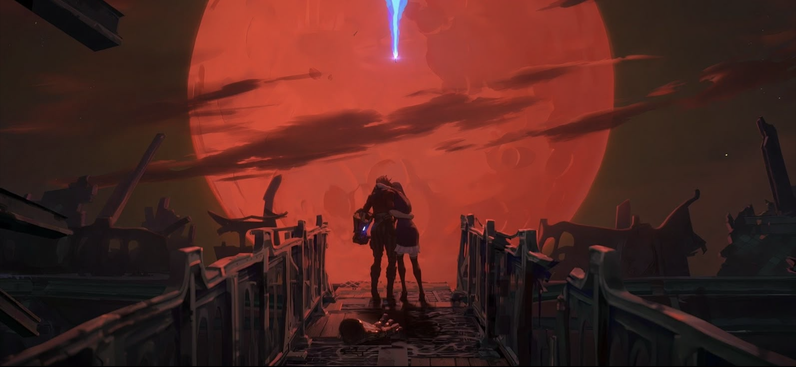
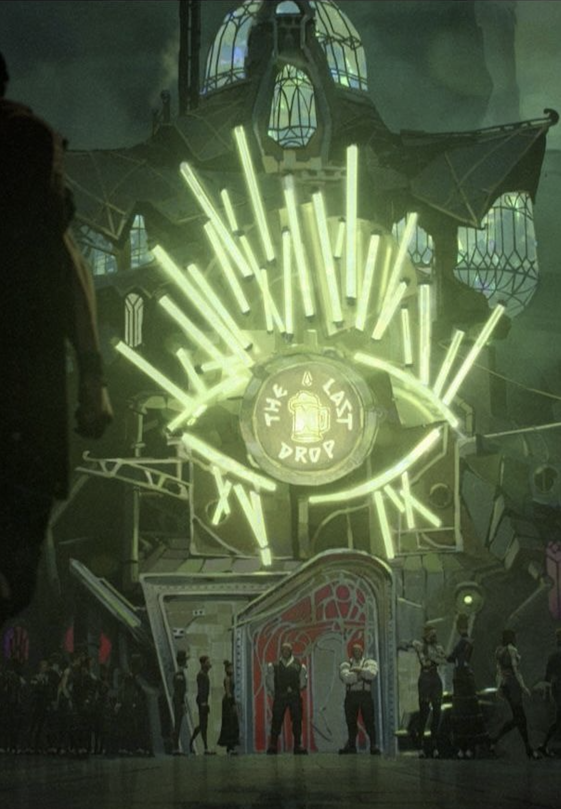
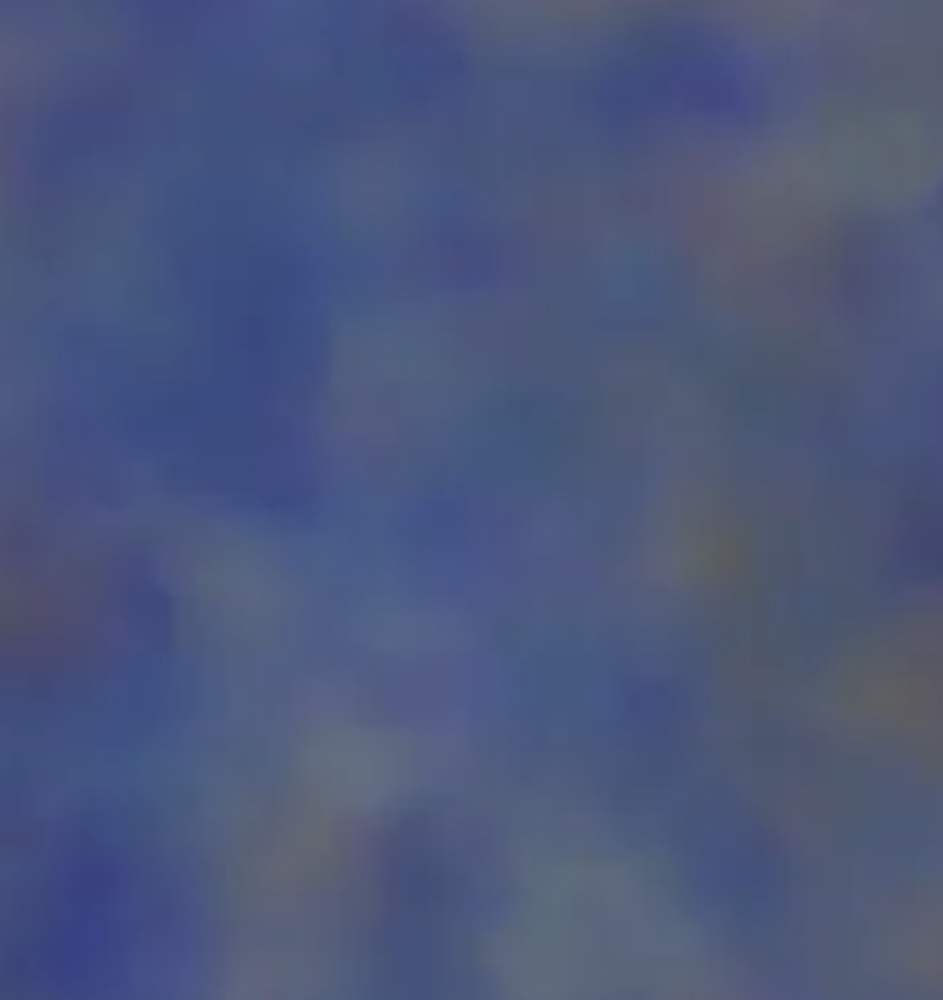
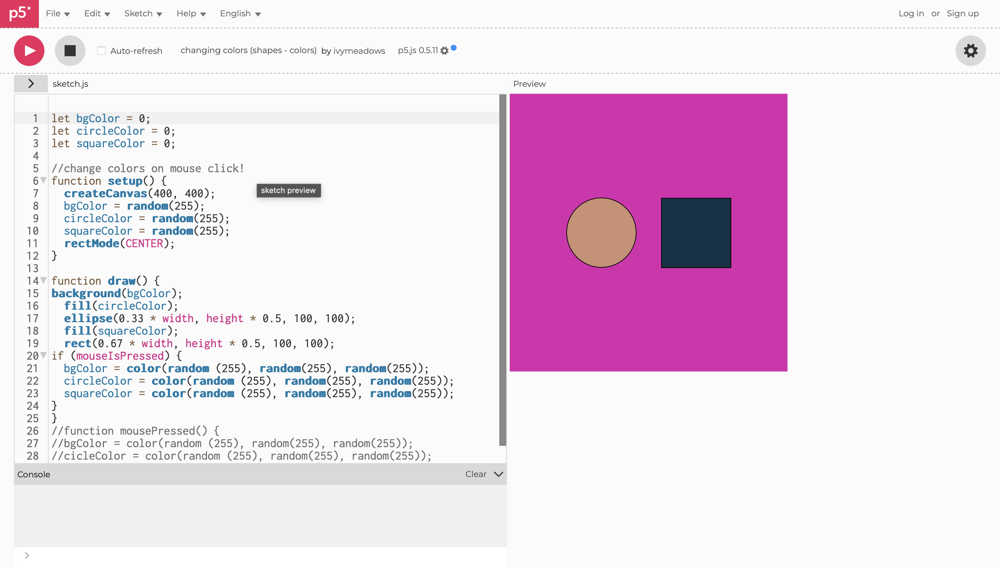
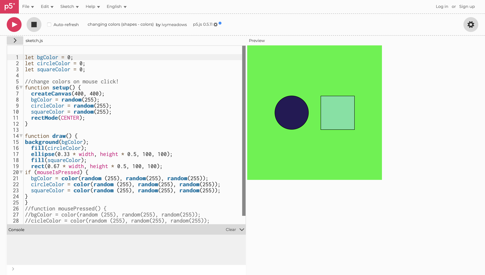
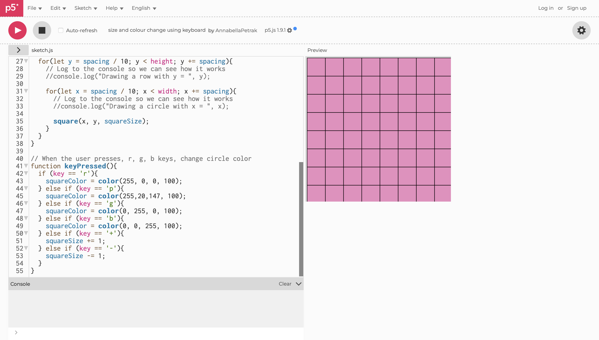
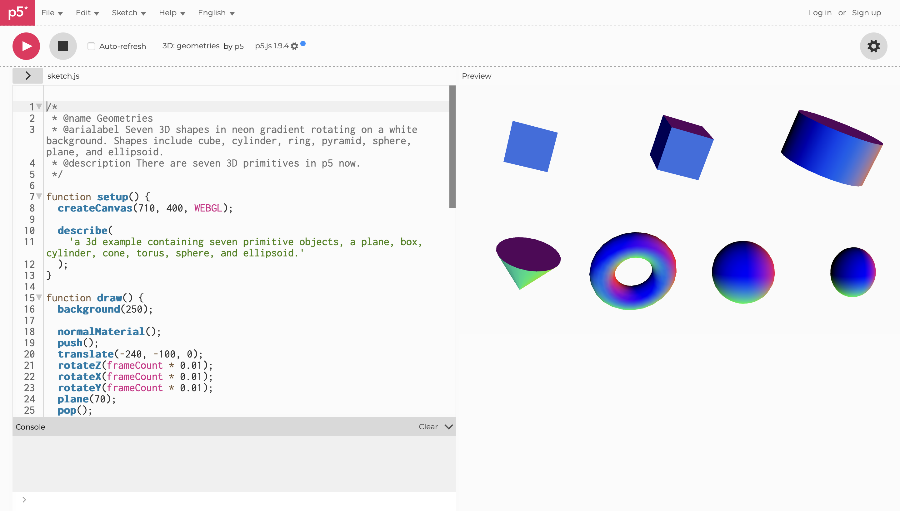
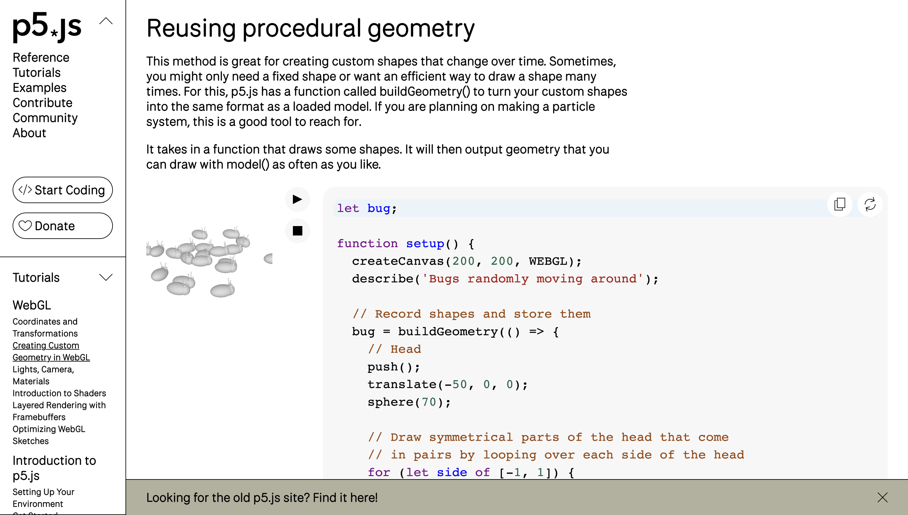
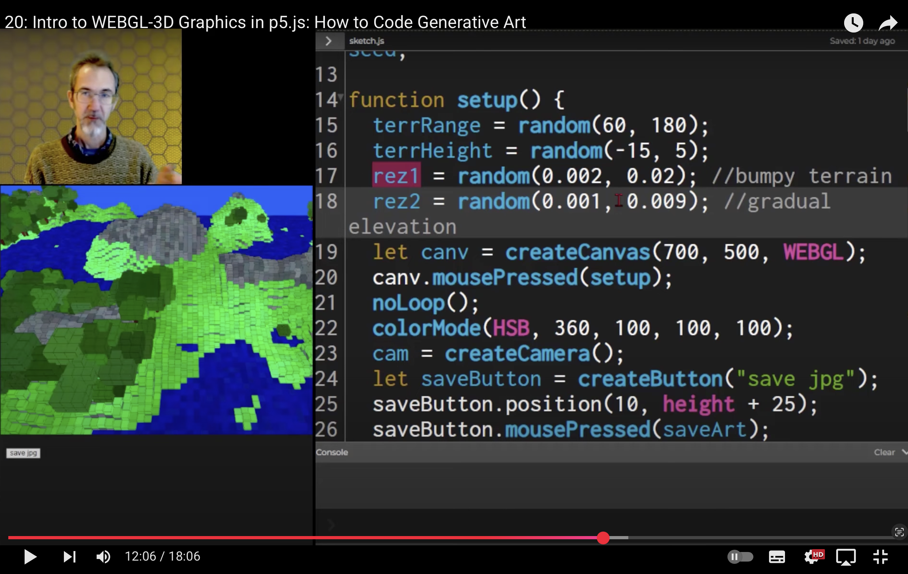

##### mnap0464_9103_tut03_quiz_week9

 

## Imagin Techique Inspiration:

> 
>  
>
>In Arcane the **use of colors** and how they can change a scene is fascinating. Colors are used in a very ***expressive*** way to express the drama of a scene ([Arcane image 1](https://in.pinterest.com/pin/1008243435341627746/) ) or to characterize specific places in the setting, ([Arcane image 2](https://it.pinterest.com/pin/402861129190891341/)). In the series we are shown this bar "The Last Drop" in various contexts, it changes along with the plot and it is really intresting to see how in these two scenes ([Arcane image 3](https://it.pinterest.com/pin/427982770857075007/), [Arcane image 4](https://it.pinterest.com/pin/362047257566218432/)) this bar changes drastically, depending on how events go. For this series they use **3D** characters on a **2D** background but the difference is not that noticeable due to the peinted ***texture*** used on the 3D model.
> 
>  
>

 

 Arcane: 1

 

 Arcane: 2

 

 Arcane: 3

 

 Arcane: 4

 
 

>
> ### Main points:
>
> - 2D background ([painting](https://www.youtube.com/watch?v=MEYdsoZua7E));
> - [Change the color of scene](https://editor.p5js.org/ivymeadows/sketches/B1PpMXlsZ);
> - [3D](#techniques-for-3d-elements) characters or object (with particular shades);
> 
>  
>

 
 
 

## Cooding Technique Exploration:
> 
>  
>
>There are several techniques and blocks of code that I could use to create the various techniques that interest me. Surely to get an effect ***similar*** to that of Arcane I need to create the [painted texture](https://www.youtube.com/watch?v=MEYdsoZua7E) for the background, the [3D elements](#techniques-for-3d-elements) that will be in the foreground and that can be considered the ***protagonists*** of the scene. They will have a texture ***similar*** to the background but in a way in a way where it is still possible to distinguish the background and the object. Finally to be able to change the color of the scenery, I could use various interactions such as pressing the [mouse](https://editor.p5js.org/ivymeadows/sketches/B1PpMXlsZ) or the [keyboard](https://editor.p5js.org/AnnabellaPetrak/sketches/vO9avJzv7).
>
>  
>
>  Painted texture
> 
>  
>
>  (1) Change colors with the maus arrow
> 
>  
>
>  (2) Change colors with the maus arrow
> 
>  
>
>  (3) Change colors with the key-board
> 
>  
>

 
 

 #### TECHNIQUES FOR 3D ELEMENTS:
>
>  
>
> - [3D](https://editor.p5js.org/p5/sketches/3D:_geometries) (1.0): Code who show how to generete 3D shape.
> - [3D](https://p5js.org/tutorials/custom-geometry/) (1.2): How to create Custom Geometry.
>
> - [3D](https://www.youtube.com/watch?app=desktop&v=HJ7D0ysUL74) (1.3): How to creaste landscape whit generative art.
>
> - [3D](https://archive.p5js.org/learn/getting-started-in-webgl-coords-and-transform.html) (1.4): Understand better the 2D and the 3D in p5.js.
>
> 
>
> [3D](https://editor.p5js.org/p5/sketches/3D:_geometries) (1.0)
>
> 
>
> [3D](https://p5js.org/tutorials/custom-geometry/) (1.2)
>
> 
>
> [3D](https://www.youtube.com/watch?app=desktop&v=HJ7D0ysUL74) (1.3)
>
> 
>
> [3D](https://archive.p5js.org/learn/getting-started-in-webgl-coords-and-transform.html) (1.4)
>
> 
>

