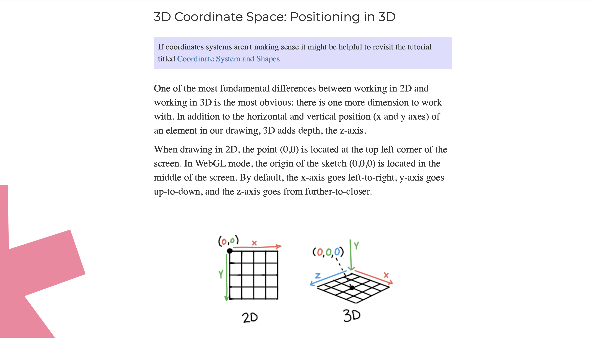

##### mnap0464_9103_tut03_quiz_week9

## Imagin Techique Inspiration:

> 
>  
>
>In Arcane the ***use of colors*** and how they can change a scene is fascinating. Colors are used in a very *expressive* way to express the drama of a scene ([Arcane image 1](https://in.pinterest.com/pin/1008243435341627746/) ) or to characterize specific places in the setting, ([Arcane image 2](https://it.pinterest.com/pin/402861129190891341/)). In the series we are shown this bar  "The Last Drop" in various contexts, it changes along with the plot and it is fascinating to see how in these two scenes ([Arcane image 3](https://it.pinterest.com/pin/427982770857075007/), [Arcane image 4](https://it.pinterest.com/pin/362047257566218432/)) this bar changes drastically, depending on how events go. For this series they use **3D** characters on a **2D** background but the difference is not that noticeable due to the ***texture*** used on the 3D model.
> 
>  
>

 

 Arcane: 1

 

 Arcane: 2

 

 Arcane: 3

 

 Arcane: 4

 

>
> ### Main points:
>
> - 2D background ([painting](https://www.youtube.com/watch?v=MEYdsoZua7E));
> - [Change color of the scenary](https://editor.p5js.org/ivymeadows/sketches/B1PpMXlsZ);
> - [3D](#techniques-for-3d-elements) characters or object (with particular shades);
> 
>  
>

## Cooding Technique Exploration:
> 
>  
>
>For the background texture I could use this technique of [painting](https://www.youtube.com/watch?v=MEYdsoZua7E). There are various techniques and pieces of code that I could use to create [3D elements](), thay can  have the same texture as the background, so that they are not too detached. Finally you could use the mouse or keyboard to interact and [change color of the scenary](https://editor.p5js.org/ivymeadows/sketches/B1PpMXlsZ)
>
>  
>
>  Painted texture
> 
>  
>
>  Change colors (1)
> 
>  
>
>  Change colors (2)
> 
>  
>

 #### TECHNIQUES FOR 3D ELEMENTS:
>
>  
>
> - [3D](https://editor.p5js.org/p5/sketches/3D:_geometries) (1.0): Code who show how to generete 3D shape.
> - [3D](https://p5js.org/tutorials/custom-geometry/) (1.2): How to create Custom Geometry.
>
> - [3D](https://www.youtube.com/watch?app=desktop&v=HJ7D0ysUL74) (1.3): How to creaste landscape whit generative art.
>
> - [3D](https://archive.p5js.org/learn/getting-started-in-webgl-coords-and-transform.html) (1.4): Understand better the 2D and the 3D in p5.js.
>
> 
>
> [3D](https://editor.p5js.org/p5/sketches/3D:_geometries) (1.0)
>
> 
>
> [3D](https://p5js.org/tutorials/custom-geometry/) (1.2)
>
> 
>
> [3D](https://www.youtube.com/watch?app=desktop&v=HJ7D0ysUL74) (1.3)
>
> 
>
> [3D](https://archive.p5js.org/learn/getting-started-in-webgl-coords-and-transform.html) (1.4)
>
> 
>

